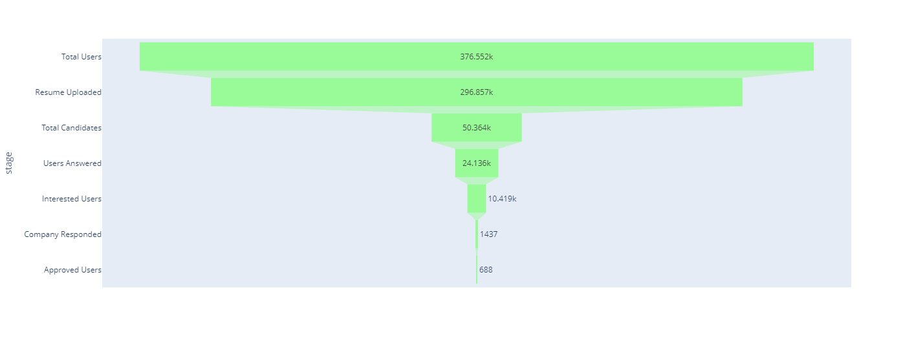
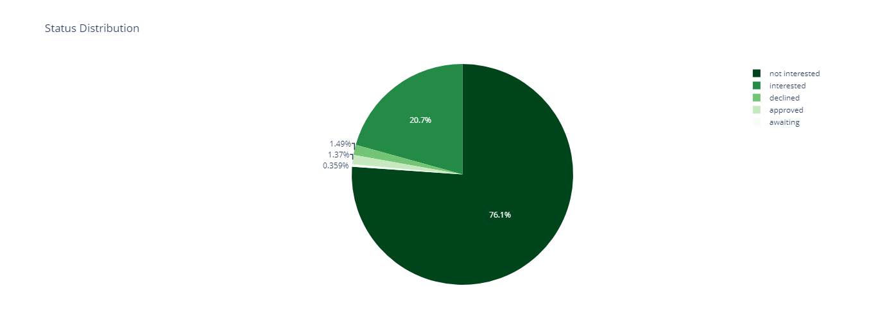
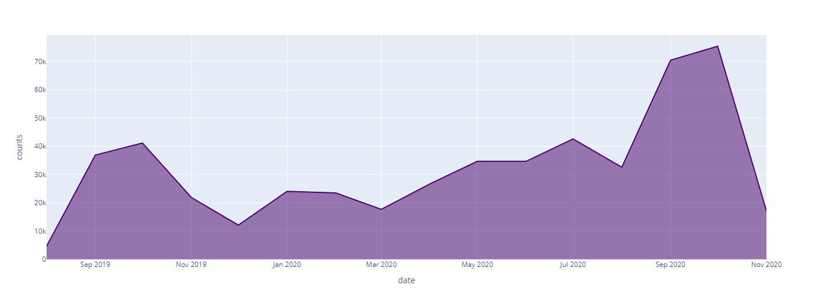

# **JobTeaser Final Project**
Le Wagon - Data Analytics Final Project: A comprehensive data analytics project developed as the final assessment for the Le Wagon Data Analytics Bootcamp. The project includes data exploration, preprocessing, machine learning, and visualization, applying key concepts learned throughout the course.

## **1. Introduction:**
### **Context:**
**JobTeaser** is a platform that connects students and companies by managing career services for over 750 universities globally. It provides a **matching tool** where companies can shortlist students for job opportunities. Optimizing the job placement funnel is critical to enhancing student employment rates and improving the platform's efficiency.

**Job placement funnel:**
The job placement funnel is:
- opt-in (student activate a toggle "looking for opportunities")
- opt-in qualified (students upload their CV)
- students being shortlisted by the algorithm
- students answered
- students being interested
- companies answered
- companies approved

Analyzing this funnel will help the product team improve the job placement of the users.


### **Project goal:**
The goal of this project is to analyze and optimize the JobTeaser job placement funnel by identifying bottlenecks in the current process and suggesting improvements to increase student engagement and job matches.

## **2. Data Overview:**
This analysis uses three key datasets:
#### **Opt-in Table (optin):**
 Contains data about students opting in or out of JobTeaser services.

- **user_id:** ID of the student.
- **receive_time:** Date/time of opt-in/out.
- **cause:** Reason (manual or automatic).
- **active:** TRUE if opted in, FALSE if opted out.
- **school_id:** ID of the school.
- **current_sign_in_at:** Last login time.
- **resume_uploaded:** Whether the CV was uploaded.

#### **Candidate Status Update (candidate_status_update):**
Tracks students' status updates within the job application process.

- **user_id**: ID of the student.
- **receive_time**: Date/time of the event.
- **shortlist_id**: ID of the shortlist.
- **status_update**: Status (estudiante: `awaiting`, `interested`, `not interested`; empresa: `approved`, `declined`).
- **cause**: Reason (click or timeout).
- **school_id**: ID of the school.
- **current_sign_in_at**: Last login time.


#### **School Info Table (dim_schools):**
Provides data about the schools participating in JobTeaser's services.

- **school_id:** ID of the school.
- **is_cc:** Career center or public site.
- **intranet_school_id:** ID of the career center, if applicable.
- **jt_country:** Country of the school.
- **jt_intranet_status:** Status "launched" for career centers.
- **jt_school_type:** Type of school (1: Engineering, 2: Business, 3: Other).

## **3.Data preparation**
The initial datasets we received were stored in BigQuery and comprised three key tables. Before transitioning to the analysis in Python, we performed a thorough inspection of all three tables to identify and address any duplicate records. The SQL queries used for this process were applied to each of the tables. Below, we present the example of one of the tables (candidate_status_update), but the same process was followed for the other two.

To detect duplicates, we used the following SQL query:

```sql
SELECT
    user_id,
    receive_time,
    shortlist_id,
    status_update,
    cause,
    school_id,
    current_sign_in_at,
    COUNT(*) AS duplicate_count
FROM
    `candidate_status_update`
GROUP BY
    user_id,
    receive_time,
    shortlist_id,
    status_update,
    cause,
    school_id,
    current_sign_in_at
HAVING
    COUNT(*) > 1
```

After identifying the duplicate rows, we removed them, retaining only one unique instance of each record. This was done using the following SQL query:

```sql
CREATE OR REPLACE TABLE `candidate_status_update_cleaned` AS
WITH CTE AS (
    SELECT *,
           ROW_NUMBER() OVER (
               PARTITION BY user_id, receive_time, shortlist_id, status_update, cause, school_id, current_sign_in_at
               ORDER BY user_id
           ) AS rn
    FROM
        `candidate_status_update`
)
SELECT
    user_id,
    receive_time,
    shortlist_id,
    status_update,
    cause,
    school_id,
    current_sign_in_at
FROM
    CTE
WHERE
    rn = 1
```

Once the datasets were cleaned and duplicates were removed, we exported the final versions to CSV format for further analysis.

## **4. Exploratory Data Analysis and Preliminary Visualization**
Following data preparation, we carried out an Exploratory Data Analysis (EDA) and created a set of preliminary visualizations using Python. The code for this analysis is detailed within the notebook, but due to display limitations, the key visualizations have been included here.

### **Preliminary Funnel Analysis:**



Our analysis identified two key bottlenecks in the candidate funnel:

The first bottleneck occurs at the shortlist stage, where many candidates fail to advance.
The second bottleneck is at the company response stage, where there is a significant drop in recruiter engagement.

### **Distribution of Status Updates:**



We observed that a large percentage of candidates are categorized as "Not Interested," suggesting a possible disconnect between job opportunities and candidate preferences.

### **User Count Over Time:**



This visualization highlighted a noticeable increase in user activity during September and October. A possible hypothesis for this trend is that, in Europe, more job seekers become active during this period, possibly due to the academic calendar and post-summer job search activity.

For more detailed visual analysis, we utilized Power BI, where we expanded the insights through an interactive dashboard.

## **5. Conclusions and Recommendations**
### **Conclusions:**
- **Imbalance between supply and demand:**
There is a notable discrepancy between the number of job offers and the number of candidates actively engaging with them, which may be affecting the overall effectiveness of the hiring process.

- **Suboptimal shortlist generation:**
The algorithm responsible for generating shortlists is not delivering optimally sized lists, leading to inefficiencies in candidate selection.

- **Two major bottlenecks in the hiring funnel:**
Our analysis identified significant challenges in two areas:
The shortlist stage, where many candidates are filtered out.
The company response stage, where there is a lack of recruiter engagement.

- **High rejection rate of job offers:**
A significant number of candidates are rejecting job offers, possibly indicating a misalignment between the opportunities presented and the candidates' expectations.

- **Low success rate:**
The overall success rate of matching candidates to job opportunities is low, indicating a need for optimization in both the candidate and recruiter sides of the platform.

### **Recommendations:**
- **Investigate job offer rejections:**
Further analysis is needed to understand the reasons behind the high rate of job offer rejections. This could help in adjusting the matching process to better align with candidate preferences.

- **Refine the shortlist generation algorithm:**
We recommend adjusting the algorithm that generates shortlists to ensure they are better tailored to the needs of both recruiters and candidates, which should improve the quality and efficiency of matches.

- **Introduce a feedback system:**
Implementing a feedback mechanism to gather input from both candidates and recruiters could provide valuable insights into pain points within the hiring process, helping to inform future platform improvements.

- **Develop strategic partnerships with talent-seeking companies:**
Establishing partnerships with companies actively searching for talent would not only enhance engagement but also improve the overall placement success rate on the platform.


